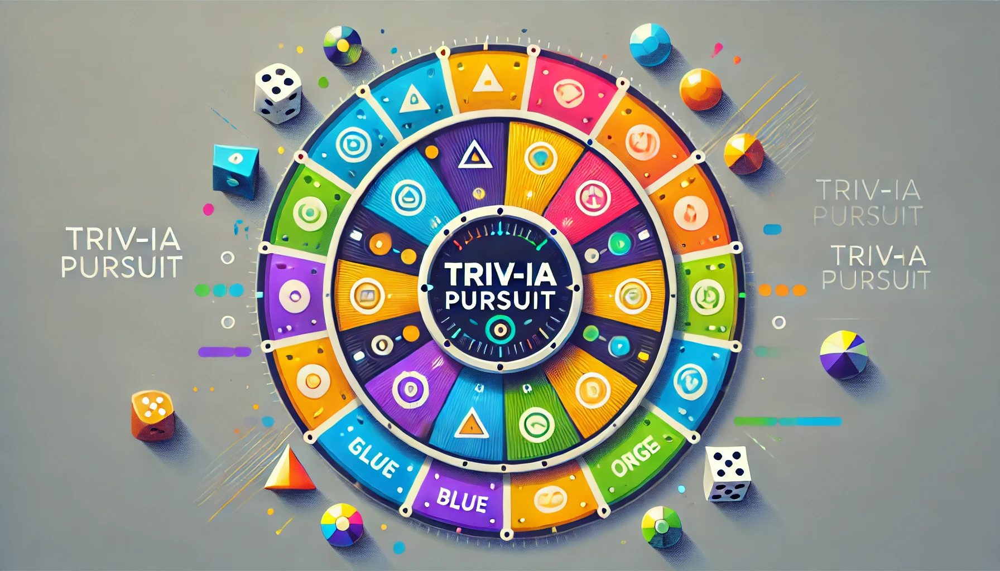

# <p align="center">Triv-IA Pursuit</p>
<p align="center">
    
</p>

## ➤ Menu

* [➤ Project Structure](#-project-structure)
* [➤ How to Run](#-how-to-run)
* [➤ Outputs](#-outputs)
* [➤ Evaluation Criteria](#-evaluation-criteria)
* [➤ Performance Metrics](#-performance-metrics)
* [➤ License](#-license)
* [➤ Authors](#-authors)

---

## Project Structure

This project includes the following files and directories:

- **data**
    - **questions.json**: Contains all the questions and answers categorized by themes.
- **main.py**: The entry point of the game. It handles user input to decide the game mode (solo or multiplayer).
- **src**
    - **game.py**: Manages the game logic, including question selection and turn progression.
    - **player.py**: Defines the `Player` class to manage player attributes and interactions.
    - **dice.py**: Implements the logic for dice rolling and special cases.
- **app/**: (To be implemented later) Contains the graphical user interface for the game using Pygame.

---

## How to Run

Follow these steps to execute the project:

1. Ensure Python is installed on your system.
2. Clone this repository to your local machine:

```bash
    git clone https://github.com/yourusername/Triv-IA-Pursuit.git
```
3. Navigate to the project directory:

```bash
    cd Triv-IA-Pursuit
```
4. Install the required dependencies:

```bash
    pip install -r requirements.txt
```
5. Run the main script:

```bash
    python main.py
```

---


## Outputs

The game provides the following outputs:

1. **Console Output**: A textual interface showing game progression, player turns, and question results.

2. **Graphical Interface (Pygame)**: A visual representation of the gameboard and interactive gameplay.

### Example Outputs

**Console Output:**
<p align="center">
  
</p>

**Graphical Interface:**
<p align="center">
  
</p>

---

## Evaluation Criteria

The project will be evaluated based on:

- **Group Collaboration**: Use of GitHub workflows (branches, pull requests, and code reviews).
- **Game Functionality**: Implementation of game logic and player interactions.
- **Code Quality**: Clear, maintainable code with appropriate documentation.
- **User Interface**: Intuitive and engaging console and graphical interfaces.

### Bonus Objectives:

1. Implementing easter eggs.
2. Structuring the project using object-oriented programming principles.

---

## Performance Metrics

Key indicators of success for this project include:

- **Gameplay Accuracy**: Ensuring all game rules are correctly implemented (e.g., dice rolls, special tiles, win conditions).
- **User Experience**: Providing a smooth and interactive interface for both console and graphical modes.
- **Maintainability**: Adherence to object-oriented programming practices to facilitate future updates.
- **Collaboration Efficiency**: Demonstrated teamwork and effective use of Git.


---

## Game Rules

The gameplay follows these rules:

1. **Turn Sequence**:
    - The player rolls the dice.
    - They choose a direction to move on the gameboard.
    - They answer a question related to the tile theme.
2. **Correct Answers**:
    - If correct, the player rolls again and continues their turn.
    - If incorrect, their turn ends, and the next player proceeds.
3. **Special Tiles**:
    - Every multiple of 7 is a special tile where players can win a Δ.
4. **Victory Condition**:
    - The first player to collect all six Δs wins the game.

---

## License

[MIT License](LICENSE)

```
Permission is hereby granted, free of charge, to any person obtaining a copy
of this software and associated documentation files (the "Software"), to deal
in the Software without restriction, including without limitation the rights
to use, copy, modify, merge, publish, distribute, sublicense, and/or sell
copies of the Software, and to permit persons to whom the Software is
furnished to do so, subject to the following conditions:

The above copyright notice and this permission notice shall be included in all
copies or substantial portions of the Software.

THE SOFTWARE IS PROVIDED "AS IS", WITHOUT WARRANTY OF ANY KIND, EXPRESS OR
IMPLIED, INCLUDING BUT NOT LIMITED TO THE WARRANTIES OF MERCHANTABILITY,
FITNESS FOR A PARTICULAR PURPOSE AND NONINFRINGEMENT. IN NO EVENT SHALL THE
AUTHORS OR COPYRIGHT HOLDERS BE LIABLE FOR ANY CLAIM, DAMAGES OR OTHER
LIABILITY, WHETHER IN AN ACTION OF CONTRACT, TORT OR OTHERWISE, ARISING FROM,
OUT OF OR IN CONNECTION WITH THE SOFTWARE OR THE USE OR OTHER DEALINGS IN THE
SOFTWARE.
```

---

## Authors

- Antoine DELVOYE: [GitHub](https://github.com/HerculePoivrot)
- Khadija AASSI: [GitHub](https://github.com/Khadaassi)
- Leo GALLUS: [GitHub](https://github.com/Leozmee)
- Ludivine RABY: [GitHub](https://github.com/ludivineRB)
---

